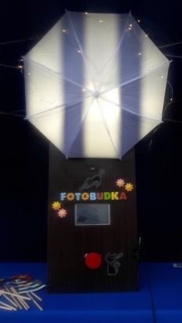

# Fotobudka

Projekt Koła Naukowego ["Fraktal"](https://www.facebook.com/fraktal.UKSW) przy WMP.SNŚ UKSW. Fotobudka powstała w celach popularyzatorskich i została zaprezentowana na 23.
PIKNIKU NAUKOWYM POLSKIEGO RADIA
I CENTRUM NAUKI KOPERNIK



# Autorzy
 Autorami projektu są Anna Kelm, Agnieszka Jamrozik, Karol Chyliński i Piotr Plebański
# Użyte materiały
* RaspberryPi (u nas: wersja 3 model B)
* RaspberryPi Camera (u nas: V2)
* Wyświetlacz, najlepiej dotykowy do wpisywania adresu e-mail (u nas: ekran dotykowy rezystancyjny Waveshare 5'')
* przycisk z diodą LED (wyjścia przycisku i LED-a obsługiwane z interfesju GPIO RaspberryPi)
* Różne dodatki (obudowa, oświetlenie...)

# Podziękowania
Dziękujemy Wojciechowi Skorupskiemu za wyprodukowanie obudowy do fotobudki.

# Uruchomienie skryptów
## Wymagane pakiety spoza obrazu "2019-04-08-raspbian-stretch-full"
* PyYAML >= 5.1 (instalacja: ```pip3 install PyYAML```)
* PyQt5 >=  (instalacja na Raspbian Stretch: ```sudo apt install python-pyqt5 -y``` )


## Pobranie skryptów
W terminalu przejdź do wybranego folderu i wpisz:
```
git clone https://github.com/gittower/git-crash-course.git
```
Następnie w folderze ze skryptami:
```
chmod +x *.py
chmod +x *.sh
```
## Uruchomienie
### Kompletna Fotobudka z wysyłaniem zdjęć e-mailem:
Ustaw konfigurację serwera e-mail (```photoconfig.yaml```). 
Następnie w terminalu wejdź do folderu z Fotobudką i wpisz:
```
./photobooth_run.sh
```
### Fotobudka bez wysyłania zdjęć:
W terminalu wejdź do folderu z Fotobudką i wpisz:
```
./photobooth.py
```
# Licencja
2019 Koło Naukowe "Fraktal" przy WMP.SNŚ UKSW

Niniejszy program jest wolnym oprogramowaniem; możesz go
rozprowadzać dalej i/lub modyfikować na warunkach Powszechnej
Licencji Publicznej GNU, wydanej przez Fundację Wolnego
Oprogramowania - według wersji 3 tej Licencji lub (według twojego
wyboru) którejś z późniejszych wersji.

Niniejszy program rozpowszechniany jest z nadzieją, iż będzie on
użyteczny - jednak BEZ JAKIEJKOLWIEK GWARANCJI, nawet domyślnej
gwarancji PRZYDATNOŚCI HANDLOWEJ albo PRZYDATNOŚCI DO OKREŚLONYCH
ZASTOSOWAŃ. W celu uzyskania bliższych informacji sięgnij do     Powszechnej Licencji Publicznej GNU.

Z pewnością wraz z niniejszym programem otrzymałeś też egzemplarz
Powszechnej Licencji Publicznej GNU (GNU General Public License);
jeśli nie - zobacz <http://www.gnu.org/licenses/>.
